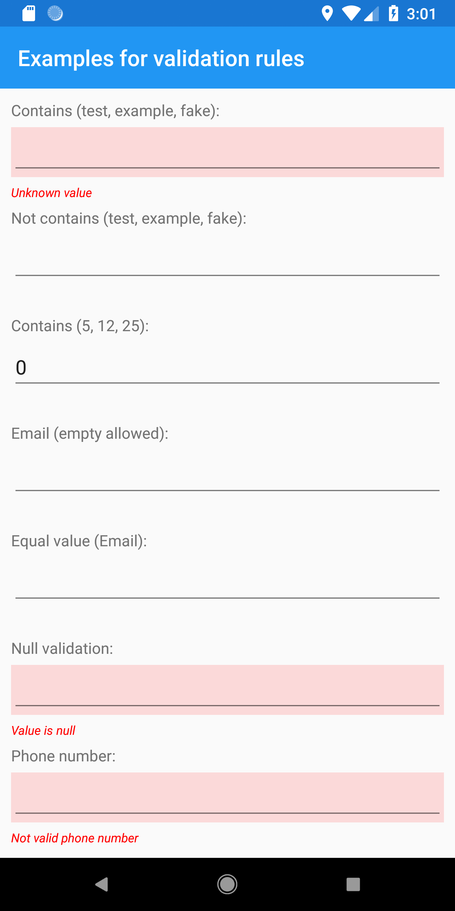
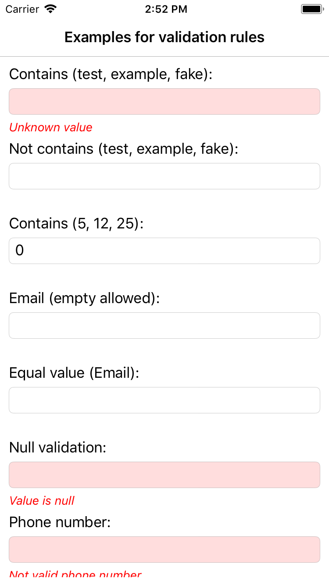
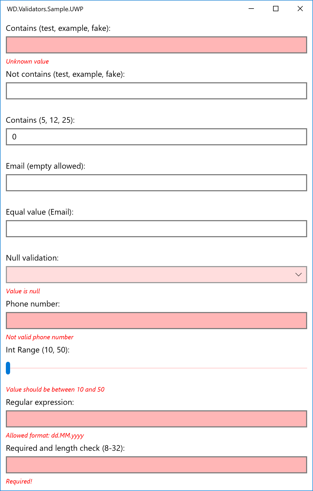
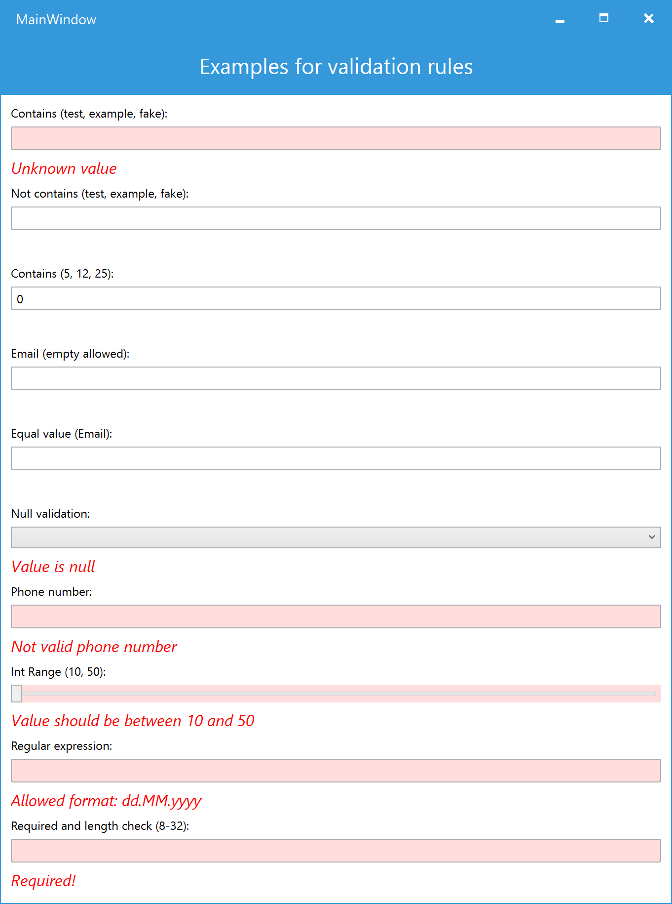
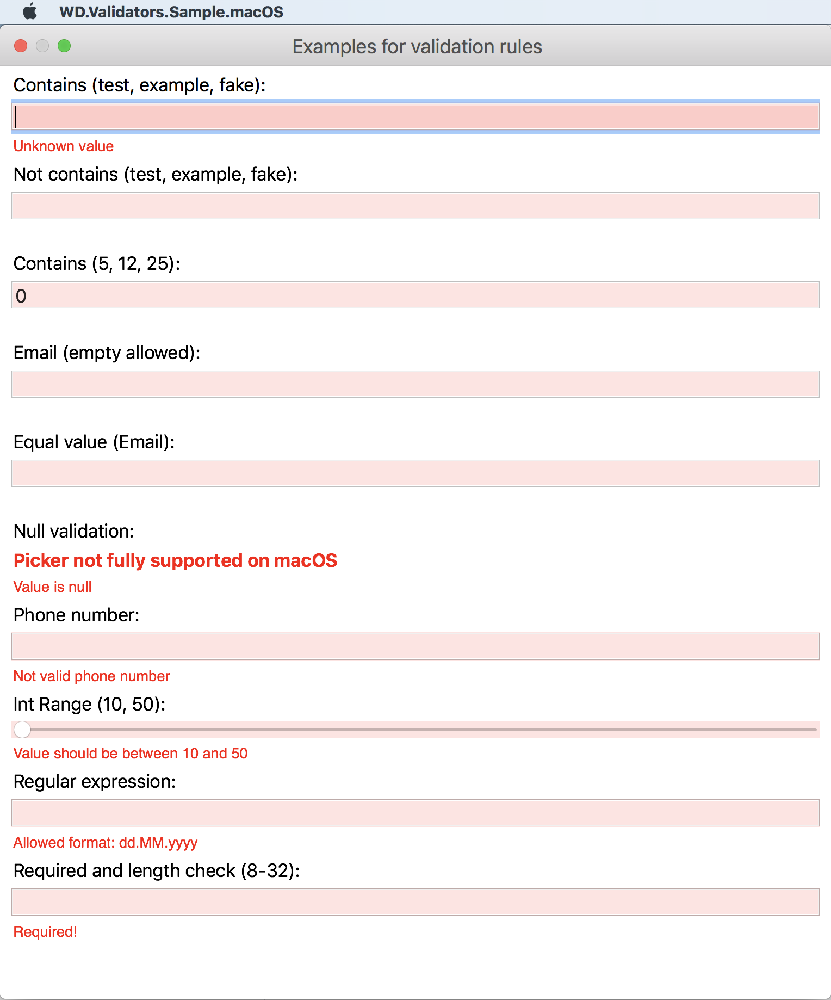

# WebDucer Value Validators

Library with common value validators to be used in UI application (e.g. ASP.Net Core, Xamarin, UWP, WPF). The library is based on the ideas from the following book:

- [Enterprise Application Patterns using Xamarin.Forms](https://docs.microsoft.com/en-us/xamarin/xamarin-forms/enterprise-application-patterns/)

## States

| Service | Last | Develop | Master |
| :------ | ---: | ------: | -----: |
| AppVeyor last | [](https://ci.appveyor.com/project/WebDucer/wd-valuevalidators) | [](https://ci.appveyor.com/project/WebDucer/wd-valuevalidators/branch/develop) | [](https://ci.appveyor.com/project/WebDucer/wd-valuevalidators/branch/master)
| SonarCube coverage | | [](https://sonarcloud.io/dashboard?branch=develop&id=WD.ValueValidators) | [](https://sonarcloud.io/dashboard?id=WD.ValueValidators) |
| SonarCube technical debt | | [](https://sonarcloud.io/dashboard?branch=develop&id=WD.ValueValidators) | [](https://sonarcloud.io/dashboard?id=WD.ValueValidators) |
| SonarCube Quality Gate | | [](https://sonarcloud.io/dashboard?branch=develop&id=WD.ValueValidators) | [](https://sonarcloud.io/dashboard?id=WD.ValueValidators) |
| Nuget |  [](https://www.nuget.org/packages/WD.ValueValidators) | [](https://www.nuget.org/packages/WD.ValueValidators) | [](https://www.nuget.org/packages/WD.ValueValidators) |

## Validation Rules

- `ContainsValidationRule` - Check, if the value is in the given collection (with possibility to inverse the result)
- `EmailValidationrule` - Check, if the value is a valid email address
- `EqualValuesValidationRule<T>` - Compare two values for equality
- `NullValidationRule` - Check, if the value is `null`
- `PhoneNumberValidationRule` - Check, if the value is valid phone number (with allowed separators `-`, `()`, `.`)
- `RangeValidationRule<T>` / `PrimitiveRangeValidationRule` - Compare the value to a given min and max values
- `RegexValidationRule` - Check, if the value match the given regular expression
- `RequiredValidationRule` - Check, if the string value is set (with a flag, for white spaces treaded as valid values)
- `StringLengthValidationRule` - Check the max or min length of a string
- `GreaterThanRule` - Check, if the value is greater (or equal) to a given value
- `SmallerThanRule` - Check, if the value is smaller (or equal) to a given value
- `RevalidateOtherValueRule` - Trigger the validation of another validatable value

## Usage

Initialize your validatable values in your view model.

```csharp
MyValidatableValue = new ValidatableValue<string>
{
    ValidationRules = new IValidationRule<string>[]
    {
        new ContainsValidationRule<string>("Value not allowed", new[] {"test", "example", "fake"}, true),
        new StringLengthValidationRule("The value should have at least 2 characters", 2, false),
        new StringLengthValidationRule("The value should have at maximum 16 charachters", 16),
        new RequiredValidationRule("Value is required")
    }
};
```

Bind the value in your XAML code.

```xml
...
<Label Text="My value:" />
<Entry Text="{Binding MyValidatableValue.Value}"
       BackgroundColor="{Binding MyValidatableValue.IsValid, Converter={StaticResource ValidationColorConverter}}"/>
<Label Text="{Binding MyValidatableValue.FirstError}"
       Style="{StaticResource ErrorMessage}" />
...
```

## Screenshots







